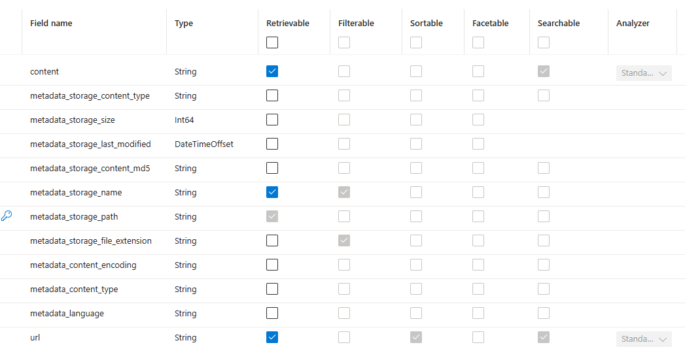

# Help docs bot

## Portal configuration:

the storage account
- 1 container; no special configuration.

the Azure AI Search index:
- You need this field availability: 

## Python automation scripts:
1. git-update: pull latest help-docs-pr from github. 
1. make-local-index: clear the local-index contents and create anew: local flat index list
    1. ignore the archive folder
    1. rename the files so the name reflects the folder path, using a special delimiter
1. blob-upload: blanket upload docs to the storage blob (quits after a certain number?)
    1. set-url-metadata: for each .md doc, create the url metadata value and attach it to the blob
    1. rm-include-urls: set the url metadata for includes to blank
    2. propagate deletions to the datasource object?? (enabled now, I think)
1. refresh the indexer and run it again.
1. re-attach the index to the help-docs-bot GPT deployment. (actually, if the index is updated then the bot performance will be updated)
1. TODO: re-deploy the help-docs-bot to the web app endpoint
    1. can that be automated? Ask michael?

## Further enhancements

- enable vector search (done at the index-creation step I think)
    - possibly hybrid search and reranking too.
- don't give includes a url (filter "include/" out of the path.)
- clear the metadata of all existing include files
- estimate costs
- enable prompt-rewriting? is it automatic?
- anything here? https://github.com/Azure-Samples/azure-search-openai-demo/
- investigate knowledge service - https://eng.ms/docs/cloud-ai-platform/commerce-ecosystems/growth-ecosystems/growth-engineering/learn-discovery/learn-knowledge-service-partner-integration-docs 
- use 0.3 temperature
- do evaluation.

## context with other projects

- dina wants to work on a vscode extension
- we're writing a proposal for the leadership team.. to get visibility.
- Amy viviano is workiing on a similar extension - not chat, but to use ai to automatically apply the platform manual's rules to your doc.
